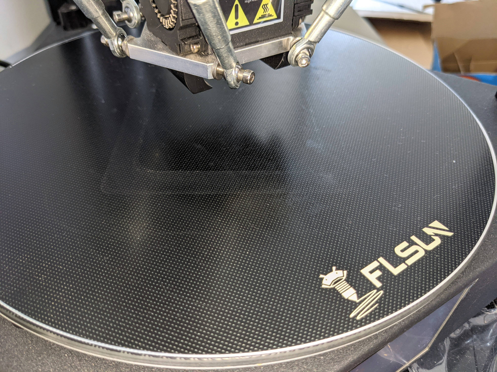

# Prime Line compilation

## QQ-S

By [Nicolas Lopez](https://www.facebook.com/groups/120961628750040/permalink/907461573433371/?comment_id=907569063422622)
 ```gcode
G0 X110 Z5 F5000
G1 Z0.3
G3 I-110 J0 X0 Y110 E16 ; 1/4 circle wipe to prime the nozzle
G2 I0 J-110 X110 Y0 ; 1/4 circle wipe to prime the nozzle
G1 Z5
 ```
  

By [Arno Zwaag](https://www.facebook.com/groups/120961628750040/permalink/922020695310792/)



```gcode
; FLSUN QQSP Custom Start G-code for Cura
;{material_print_temperature} {material_bed_temperature}
G21 ; set units to millimeters
G90 ; Set all axes to absolute
G28 ; Go to origin on all axes
M82 ; Set E to Absolute Positioning
M107 T0 ; Fan Off

M117 Heating ; Update display
M190 S{material_bed_temperature} ; heat bed and wait
M109 S{material_print_temperature} T0 ; wait for nozzle to reach temp
G92 E0 ; Zero extruder position
M117 Purging ; Update display
G00 X-1130 Y0 F3000
G0 E3 F200 ;Prepare 
G02 I300 F3000.0 E50
G03 I300 F3000.0 E50
M117 Purge completed ; Update display
G92 E0 ; Reset Extruder
G1 X0 Y0 Z20 F9000 ;Ready to print

G92 E0 ;zero the extruded length
M117 Printing ; Update display
```

The one in [PrusaSlicer](https://github.com/prusa3d/PrusaSlicer/blob/master/resources/profiles/FLSun.ini#L777)
```gcode
; Prime line routine
M117 "Printing prime line"
G92 E0.0; reset extrusion distance
G1 X-54.672 Y-95.203 Z0.3 F4000; go outside print area
G92 E0.0; reset extrusion distance
G1 E2 F1000 ; de-retract and push ooze
G3 X38.904 Y-102.668 I54.672 J95.105 E20.999
G3 X54.671 Y-95.203 I-38.815 J102.373 E5.45800
G92 E0.0
G1 E-5 F3000 ; retract 5mm
G1 X52.931 Y-96.185 F1000 ; wipe
G1 X50.985 Y-97.231 F1000 ; wipe
G1 X49.018 Y-98.238 F1000 ; wipe
G1 X0 Y-109.798 F1000
G1 E4.8 F1500; de-retract
G92 E0.0 ; reset extrusion distance
```

## Q5

The one in [PrusaSlicer](https://github.com/prusa3d/PrusaSlicer/blob/master/resources/profiles/FLSun.ini#L821)
```gcode
G92 E0
G1 X-98 Y0 Z0.2 F4000 ; move to arc start
G3 X0 Y-98 I98 Z0.2 E40 F400 ; lay arc stripe 90deg
G0 Z1 
G92 E0.0
```
